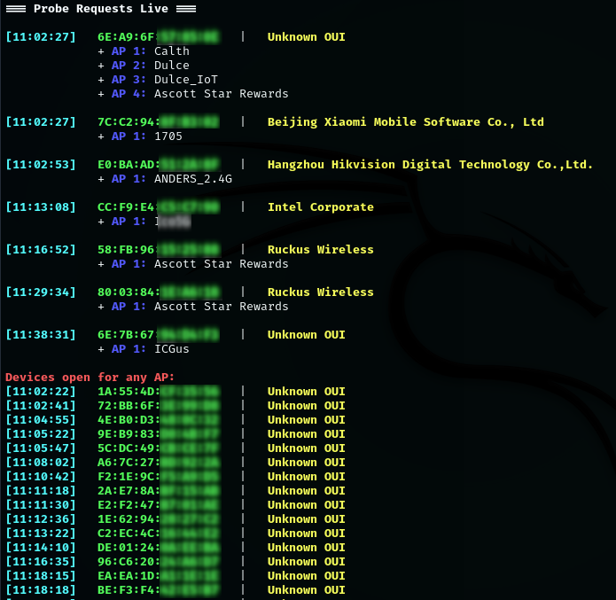

# WiFi Probe Monitor

A Bash script for Kali Linux to capture live Wi-Fi probe requests of Devices around you and display them in an organized way.  
It shows devices, their vendors (via OUI), AP names they probe for, Counter to display how many probe requests made for each.
The script also attempt to get the APs details (using Airodump-ng) like BSSID, Encryption, Channel and Power.
We can also see devices that are open to any network (wildcard probe).

## Features

- Capture live Wi-Fi probe requests of devices using `tshark`.
- Display devices with their vendor name, first seen timestamp, and probed SSIDs (with counter).
- Attempt to get APs details using `Airodump-ng`.
- Highlight devices open to any network.
- Keeps track of missing probes (wildcard or unknown SSIDs).
- Clean background processes and temp files upon Ctrl+C.

## Requirements

- Debian based Linux (Kali, Ubuntu..)
- `tshark` and `Airodump-ng` (the script will auto-install it if missing)
- Wi-Fi adapter able to be in monitor mode (script will switch it automatically)




## Installation

1. Clone this repository:

```bash
git clone https://github.com/idoCo10/WiFi-Probe-Monitor.git
cd WiFi-Probe-Monitor
sudo chmod +x wifi-probe-monitor.sh
sudo ./wifi-probe-monitor.sh
